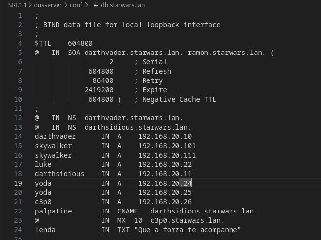
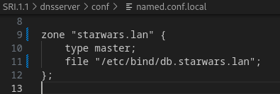
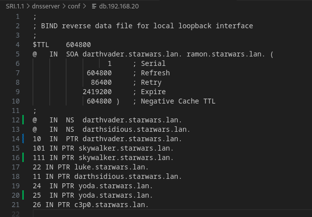

# Instalación de zonas maestras primarias.

## 1.Instala o servidor BIND9 no equipo darthvader. Comproba que xa funciona coma servidor DNS caché pegando no documento de entrega a saída deste comando dig @localhost www.edu.xunta.es

## 2.Configura o servidor BIND9 para que empregue como reenviador 8.8.8.8. pegando no documento de entrega contido do ficheiro /etc/bind/named.conf.options e a saída deste comando: dig @localhost www.mecd.gob.es

## 3. Instala unha zona primaria de resolución directa chamada "starwars.lan" e engade os seguintes rexistros de recursos (a maiores dos rexistros NS e SOA imprescindibles):
- Tipo A: darthvader con IP 192.168.20.10
- Tipo A: skywalker con IP 192.168.20.101
- Tipo A: skywalker con IP 192.168.20.111
- Tipo A: luke con IP 192.168.20.22
- Tipo A: darthsidious con IP 192.168.20.11
- Tipo A: yoda con IP 192.168.20.24 e 192.168.20.25
- Tipo A: c3p0 con IP 192.168.20.26
- Tipo CNAME palpatine a darthsidious
- TIPO MX con prioridade 10 sobre o equipo c3po
- TIPO TXT "lenda" con "Que a forza te acompanhe"
- TIPO NS con darthsidious
- Pega no documento de entrega o contido do arquivo de zona, e do arquivo /etc/bind/named.conf.local

## 4. Instala unha zona de resolución inversa que teña que ver co enderezo do equipo darthvader, e engade rexistros PTR para os rexistros tipo A do exercicio anterior. Pega no documento de entrega o contido do arquivo de zona, e do arquivo /etc/bind/named.conf.local

## 5. Comproba que podes resolver os distintos rexistros de recursos. Pega no documento de entrega a saída dos comandos:
+ nslookup darthvader.starwars.lan localhost
+ nslookup skywalker.starwars.lan localhost
+ nslookup starwars.lan localhost
+ nslookup -q=mx starwars.lan localhost
+ nslookup -q=ns starwars.lan localhost
+ nslookup -q=soa starwars.lan localhost
+ nslookup -q=txt lenda.starwars.lan localhost
+ nslookup 192.168.20.11 localhost

Imagen de los comandos...

## 6. Pega nesta tarefa o enlace ao teu repo de github

https://github.com/Ramonsa23/SRI-1.1

git status
git add .
git commit -m "Commit 2"
git push origin main

